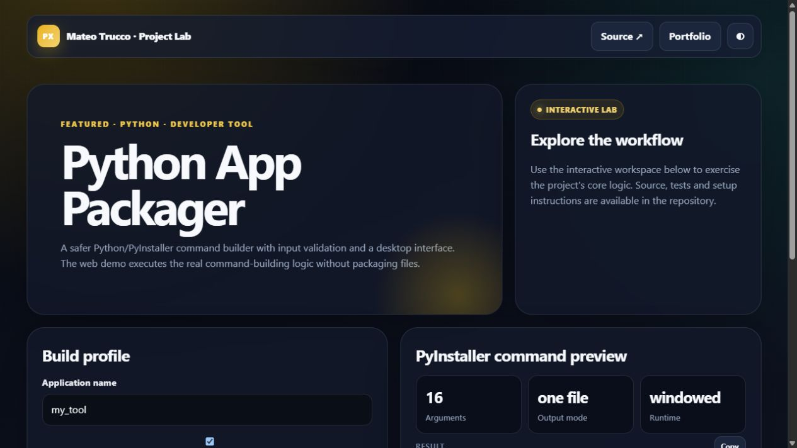

# Python App Packager

A safer graphical front end for PyInstaller.

## Improvements over the original draft

- Uses `python -m PyInstaller` and an argument list (`shell=False`)
- Validates source, destination, icon and application name
- Supports one-file/folder and console/windowed builds
- Runs in a background thread, streams logs and supports cancellation
- Explains that PyInstaller builds for the current operating system
- Includes unit tests for command construction

## Run

```bash
python -m pip install -r requirements.txt
python main.py
```

---

## Interactive preview

[](https://mateotrucco.github.io/python_app_packager/)

**[Open the live experience](https://mateotrucco.github.io/python_app_packager/)** · [View the portfolio](https://mateotrucco.github.io/)

## Engineering baseline

- Business logic separated from presentation
- Automated tests and GitHub Actions CI
- Responsive, keyboard-friendly browser experience
- MIT licensed and documented setup

